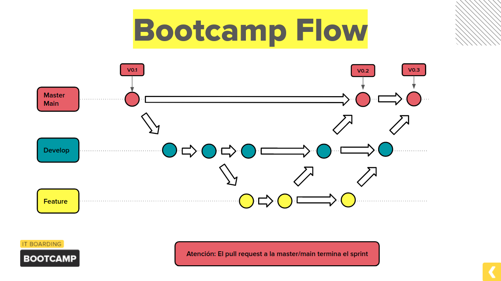

# Comandos basicos
## Test
### El siguiente comando nos corre los test y nos provee el coverage.
```sh
$ make test-cover
```
## Run
### Para correr la aplicacion podemos usar el siguiente comando.
```sh
$ make start
```

## Base de datos
### 1.  Para construir la base de datos, Lo primero que debemos hacer es descargar el servicio de MySQL.

### Linux

```sh
$ sudo apt install mysql-server
```

### Mac

```sh
$ brew install mysql
```

### 2.  Construir la base de datos.

```sh
$ make build-database
```
### 3.  Reconstruir la base de datos.
```sh
$ make rebuild-database
```
### 4.  Cambiar o agregar contraseña a la base de datos.
```sh
$ make rebuild-database-with-password
```

# Reglas del proyecto
La metodologia de trabajo que seguiremos sera la de Git Flow dejamos adjunta una imagen con una metodologia similar y mas abstraida.

<div align="center">
     
</div>

## En el proyecto deben estar:
* Rama master / main 
* Rama develop
* Rama feature (nombre del requerimiento)

```
Tomar en cuenta: para hacer un merge a master / main se debe realizar un pull request desde develop.
```